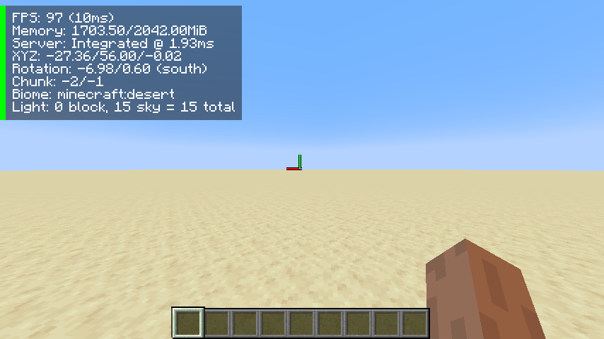
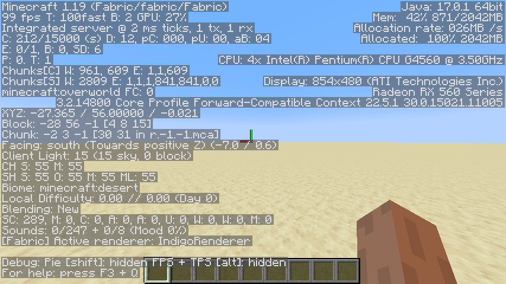

# mmic

Small client-side mod. Below is a full list of additions and changes.

## MiniF3

Replaces the default bloated F3 debug HUD with a smaller, less information-packed
version. It is (just like all other mod features) optional, and can be toggled
on/off in the mod config.

 

*The minimised debug HUD (left) vs the default debug HUD (right)*

## Brightness

Adds keybinds for increasing and decreasing the brightness options mid-game
(without having to view the options menu) as well as a fullbright toggle.

## Fake Lag

Adds a lag toggle with multiple different types of lag:

### Block

Prevents all outgoing packets from reaching the server until lag is toggled off.

### Clog

Stops all outgoing packets, sending them once lag is toggled off.

### Lossy Block

Prevents ~25% of all outgoing packets from reaching the server.

### Lossy Clog

Stops ~25% outgoing packets, sending them once lag is toggled off. Packets that
are not stopped reach the server as usual.

## Zoom

Adds a simple zoom system that modifies the in-game FOV. The zoom amount can be
changed permanently in the mod config, or temporarily by using the scroll wheel
while zoomed in.

## Grids

Adds a couple grids that one may find in a camera (e.g. rule of thirds, golden
ratio), all togglable via keybinds.
